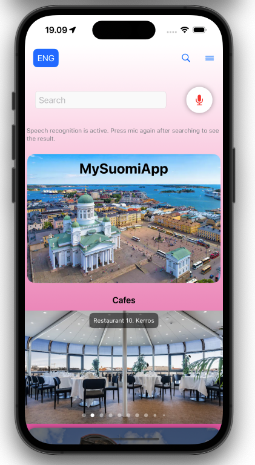
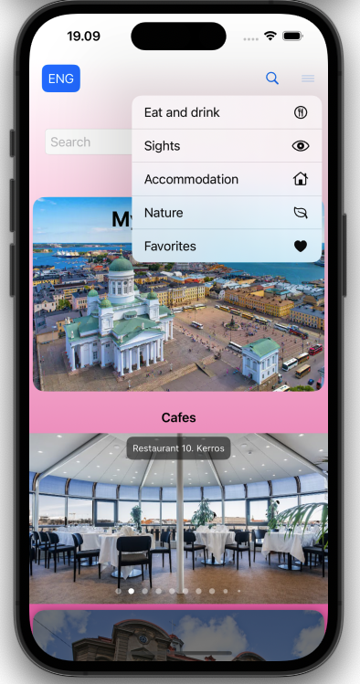
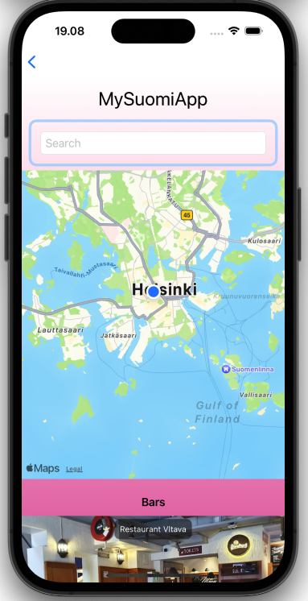
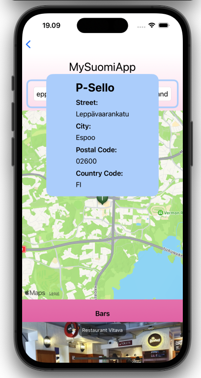
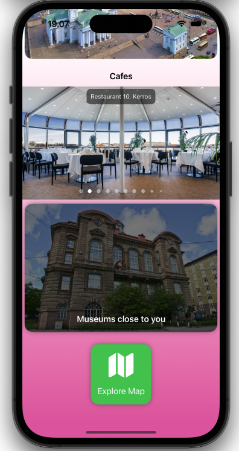
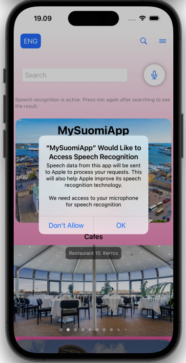
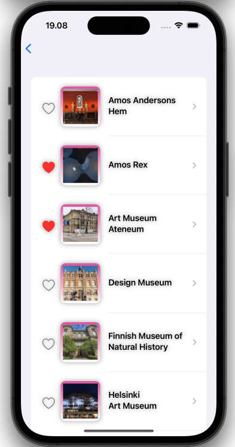
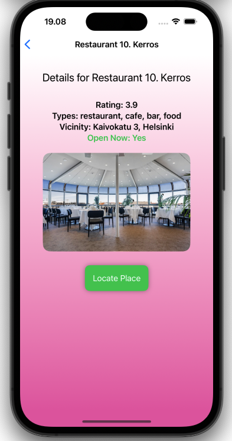

# MySuomiApp

MySuomiApp is the only application you need when you are visiting Finland. MySuomiApp helps you find places to stay, eat and drink also places to make your visit more enjoyable. 

## Features

- Easy scrollable lists
- Map to locate places
- Ability to add your favorite places to a list


## Using the product
There are few things needed before the application can work:
- Get an APIkey from Google to use the PlacesAPI (https://console.cloud.google.com/)
- Create APIKeys.swift file to MySuomiApp/Modules/ and insert the following code: 
```swift 
import Foundation

struct APIKeys {
    static let googlePlacesAPIKey = "PLACE_API_KEY_HERE"
}
```
## Screenshots 
       


## Authors

- [@MiikaJok](https://www.github.com/MiikaJok)
- [@ellasig](https://www.github.com/ellasig)
- [@JerbsH](https://www.github.com/JerbsH)
- [@gresakrasniqii](https://www.github.com/gresakrasniqii)


## Roadmap

- There are no plans to further develop this application

